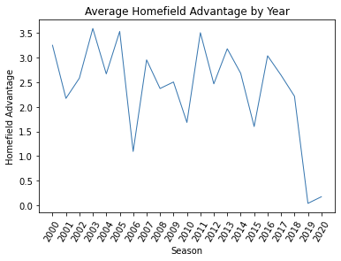

## Introduction: Describe your project scenario

* What we have in our project proposal

## The Data: Describe your data set and its significance. 

* Data scraped/collected from where

* One large data frame created from different sets of data, allowing easy access to data cleaning and analysis

* How was the data structure stored (csv files read into pandas data frames)

## Experimental Design: Describe briefly your process

* Process of choosing our data and setting goals?

## Beyond the original specifications: Highlight clearly what things you did that went beyond the original specifications. 

* Describe process of scraping, manually collecting data on location/weather/stadium descriptions

* Discuss user interaction portion (not done yet) where a user can request a specific teams home field advantage for a given year or range of years. 

* Also include an advanced queries (from rubric not sure what we would put here)

## Results: Display and discuss the results.

* Include visualizations/breakdowns of home field advantage across the years. 
*
*

## Testing: Describe what testing you did. Describe the unit tests that you wrote.

* Describe unit tests for functions to pull a given teams home field advantage (whether that be the last 20 years or one year) which we can actually create later.

## Conclusions: 

* Conclusions
